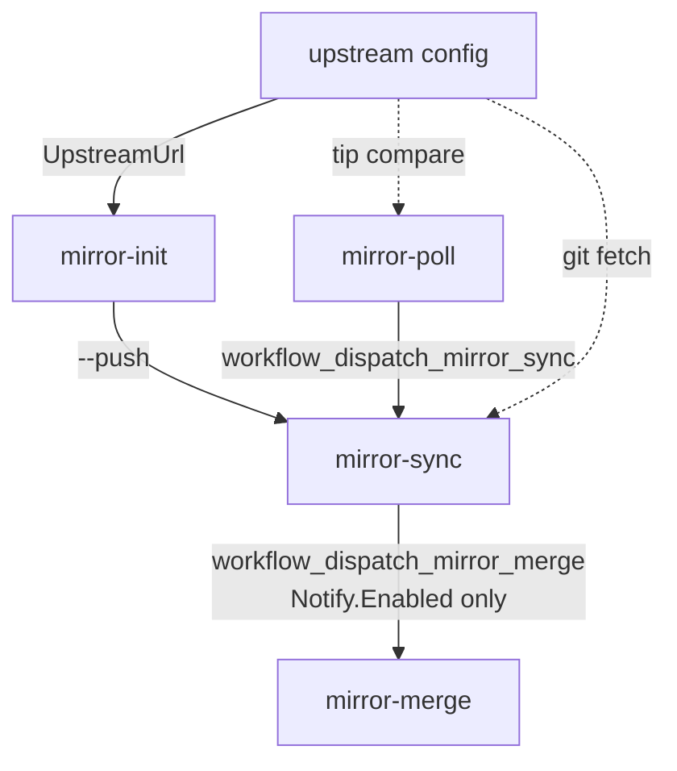

# MSYS2-APISS sync documentation

**Start here.** Pipeline architecture and doc index. Edit this file first when changing
repos, stages, CI boundaries, or operator flows.

| Doc | Role |
|-----|------|
| **This file** (`README.md`) | Pipeline architecture and index |
| [`mirror-init.md`](mirror-init.md) ... [`mirror-merge.md`](mirror-merge.md) | Stage detail |
| [`usage.md`](usage.md) | Copy-paste operator commands (GitHub + local) |
| [`add-mirror.md`](add-mirror.md) | Register a new mirror |

**Pipeline:** upstream config -> **mirror-init** -> **mirror-poll** -> **mirror-sync** ->
**mirror-merge**.

| Stage | Command / workflow |
|-------|-------------------|
| mirror-init | `yarn mirror-init` |
| mirror-poll | [`mirror-poll.md`](mirror-poll.md) |
| mirror-sync | [`mirror-sync.md`](mirror-sync.md) |
| mirror-merge | [`mirror-merge.md`](mirror-merge.md) |

## Principles

| Principle | Detail |
|-----------|--------|
| **Runtime entry** | **Local checkout** of [`cygapiss/msys2-apiss-sync`](https://github.com/cygapiss/msys2-apiss-sync) -- all operator commands run here |
| External upstream | `UpstreamUrl` in `config/mirror-sync/*.json` only; not a workflow actor |
| mirror-init | From **cygapiss/msys2-apiss-sync** code/templates: install **mirror-sync** on each `msys2-apiss/*` mirror (branch **`msys2-apiss-mirror-sync`**) and **mirror-merge** CI on destination branch **`msys2-apiss-mirror-merge`** on **`cygapiss/msys2-apiss`**. Same [Tooling branch layout](mirror-init.md#tooling-branch-layout) for both. Every `yarn mirror-init` run deploys/repairs these (unless digest-pinned); **`--push`** pushes bootstrapped repos and dispatches mirror-sync/mirror-merge; end dispatch of mirror-poll unless **`--no-poll`** ([`mirror-poll.md`](mirror-poll.md)) |
| mirror-poll | Compare tips; trigger mirror-sync when behind. See [`mirror-poll.md`](mirror-poll.md) |
| mirror-sync | [`mirror-sync.md`](mirror-sync.md) -- force-push content branch; package mirrors dispatch mirror-merge when `Notify.Enabled` |
| mirror-merge | [`mirror-merge.md`](mirror-merge.md) |
| Git surface | TypeScript wraps `git` subprocesses only |

## msys2-apiss org (mirror-init scope)

| GitHub repo | mirror-init role |
|-------------|------------------|
| **`cygapiss/msys2-apiss-sync`** (tooling) | Source of templates + TypeScript; [`mirror-poll.yml`](../.github/workflows/mirror-poll.yml) on **`main`** ([`mirror-poll.md`](mirror-poll.md)) |
| **`msys2-apiss/*`** (mirror repos) | Install [`mirror-sync.yml`](../config/mirror-template/mirror-sync.yml) on branch **`msys2-apiss-mirror-sync`** ([Tooling branch layout](mirror-init.md#tooling-branch-layout)); bootstrap `.work/mirrors/<repo>/` locally |
| **`cygapiss/msys2-apiss`** (destination) | Install [`mirror-merge.yml`](../config/mirror-template/mirror-merge.yml) on branch **`msys2-apiss-mirror-merge`** ([Tooling branch layout](mirror-init.md#tooling-branch-layout)) |

With **`--push`**, mirror-init pushes mirror workflow branches to **`msys2-apiss/*`**
and the mirror-merge workflow branch to **`cygapiss/msys2-apiss`**, then dispatches
mirror-sync on each pushed mirror repo.

## Repo map

| Repo | Stores code? | GitHub workflow? | Receives |
|------|--------------|------------------|----------|
| `msys2-apiss-sync` (tooling repo) | Yes (TypeScript + templates) | mirror-poll: `mirror-poll.yml` on `main` | mirror-sync notify -> mirror-merge (package mirrors) |
| `msys2-apiss/*` (mirror repos) | No (content only) | mirror-sync: `mirror-sync.yml` on `msys2-apiss-mirror-sync` (installed by mirror-init) | mirror-poll `workflow_dispatch_mirror_sync`; updates mirror content branch |
| `cygapiss/msys2-apiss` (destination) | No (replay output only) | mirror-merge: `mirror-merge.yml` on **`msys2-apiss-mirror-merge`** (installed by mirror-init) | `workflow_dispatch` from mirror-sync notify or manual; pushes `upstream*` |
| `msys2/*`, SourceForge, etc. | N/A | N/A | mirror-poll reads upstream tip via `ls-remote` |

## Workflow by stage

| Stage | Repo | Workflow | Command / runs | Output |
|-------|------|----------|----------------|--------|
| config | External (`msys2/*`, ...) | None | `config/mirror-sync/*.json` | -- |
| mirror-init | `cygapiss/msys2-apiss-sync` | None | `yarn mirror-init` `[--push] [--no-poll] [--repo <name>]` | mirror-sync/mirror-merge deployed |
| mirror-poll | `cygapiss/msys2-apiss-sync` | [`mirror-poll.yml`](../.github/workflows/mirror-poll.yml) on `main` | [`yarn mirror-poll`](mirror-poll.md); CI cron | mirror-sync triggered |
| mirror-sync | **`msys2-apiss/*` mirror repos** | [`mirror-sync.yml`](../config/mirror-template/mirror-sync.yml) on `msys2-apiss-mirror-sync` | mirror-poll dispatch | Mirror updated; mirror-merge when `Notify.Enabled` |
| mirror-merge | `cygapiss/msys2-apiss` | [`mirror-merge.yml`](../config/mirror-template/mirror-merge.yml) on **`msys2-apiss-mirror-merge`** | [`yarn mirror-merge`](mirror-merge.md); CI dispatch | Destination replay complete |

mirror-sync -> mirror-merge notify: [`mirror-sync.md`](mirror-sync.md). mirror-poll cron
runs on tooling repo `main`.

## Operator flows

All flows start from a **local checkout** of `cygapiss/msys2-apiss-sync` unless noted.
Copy-paste commands: [`usage.md`](usage.md).

| Scenario | mirror-init / mirror-poll / mirror-sync | mirror-merge |
|----------|----------------------------------------|--------------|
| Local init only | `yarn mirror-init` | -- |
| Full pipeline (local) | `yarn mirror-init --push` -> mirror-sync | or `yarn mirror-merge --skip-fetch` after mirrors advance |
| Full refresh (CI) | mirror-poll cron -> mirror-sync | [`mirror-merge.yml` CI](mirror-merge.md) |
| Poll only | mirror-poll -> mirror-sync | `yarn mirror-merge --skip-fetch` or wait for dispatch |
| Reset destination replay | -- | [`mirror-merge.md`](mirror-merge.md) (`--clean` or CI `clean=true`) |

## Mirror list (reference)

See [`mirror-sync.md`](mirror-sync.md#mirror-list-reference) and
[`mirror-poll.md`](mirror-poll.md#mirror-list-reference).
