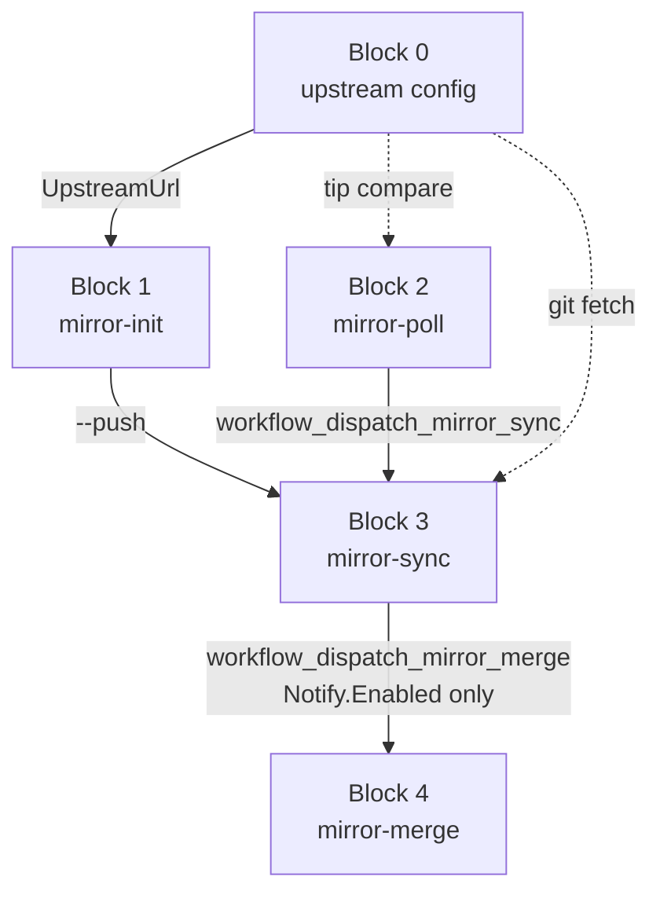

# MSYS2-APISS mirror pipeline architecture

**Center design** for the MSYS2-APISS sync pipeline. Edit this file first when changing
repos, blocks, CI boundaries, or operator flows.

**Block IDs:** 0 config -> 1 **mirror-init** -> 2 **mirror-poll** -> 3 **mirror-sync** -> 4 **mirror-merge**.

| Block | Name | CLI / workflow |
|-------|------|----------------|
| **1** | mirror-init | `yarn mirror-init` (`fetch-mirrors`) |
| **2** | mirror-poll | [`mirror-poll.md`](mirror-poll.md) |
| **3** | mirror-sync | [`mirror-sync.md`](mirror-sync.md) |
| **4** | mirror-merge | [`mirror-merge.md`](mirror-merge.md) |

---

## Detail docs

| Area | Detail doc |
|------|------------|
| Block 1: mirror-init | [`mirror-init.md`](mirror-init.md) ([Tooling branch layout](mirror-init.md#tooling-branch-layout)) |
| Block 2: mirror-poll | [`mirror-poll.md`](mirror-poll.md) |
| Block 3: mirror-sync | [`mirror-sync.md`](mirror-sync.md) |
| Block 4: mirror-merge | [`mirror-merge.md`](mirror-merge.md); algorithm in [`PLAN.md`](PLAN.md) |
| Operator commands and local testing | [`usage.md`](usage.md), [`run-local.md`](run-local.md) |

---

## Principles

| Principle | Detail |
|-----------|--------|
| **Entry point** | **Local checkout** of [`msys2-apiss/msys2-apiss-sync`](https://github.com/msys2-apiss/msys2-apiss-sync) -- all operator commands run here |
| External upstream | `UpstreamUrl` in `config/mirror-sync/*.json` only; not a workflow actor |
| Block 1 init | From **msys2-apiss/msys2-apiss-sync** code/templates: **initialize Block 3** on each `msys2-apiss/*` mirror (branch **`msys2-apiss-mirror-sync`**) and **Block 4 CI** on destination branch **`msys2-apiss-mirror-merge`** on **`msys2-apiss/msys2-apiss`**. Same [Tooling branch layout](mirror-init.md#tooling-branch-layout) for both. Every `yarn mirror-init` run deploys/repairs these (unless digest-pinned); **`--push`** pushes bootstrapped repos and dispatches Block 3/4; end dispatch of Block 2 unless **`--no-poll`** ([`mirror-poll.md`](mirror-poll.md)) |
| Block 2 poll | Compare tips; trigger Block 3 when behind. See [`mirror-poll.md`](mirror-poll.md) |
| Block 3 mirror-sync | [`mirror-sync.md`](mirror-sync.md) -- fast-forward content branch; package mirrors dispatch Block 4 when `Notify.Enabled` |
| Block 4 mirror-merge | [`mirror-merge.md`](mirror-merge.md) |
| Git surface | TypeScript wraps `git` subprocesses only |

---

## msys2-apiss org (Block 1 scope)

All Block 1 init code lives in **`msys2-apiss/msys2-apiss-sync`**. Block 1 prepares the
**msys2-apiss** GitHub org for Blocks 3-4:

| GitHub repo | Block 1 role |
|-------------|--------------|
| **`msys2-apiss/msys2-apiss-sync`** (tooling) | Source of templates + TypeScript; Block 2 [`mirror-poll.yml`](../.github/workflows/mirror-poll.yml) on **`main`** ([`mirror-poll.md`](mirror-poll.md)) |
| **`msys2-apiss/*`** (mirror repos) | Install Block 3 [`mirror-sync.yml`](../config/mirror-template/mirror-sync.yml) + `mirror-sync.json` on branch **`msys2-apiss-mirror-sync`** ([Tooling branch layout](mirror-init.md#tooling-branch-layout)); bootstrap `.work/mirrors/<repo>/` locally |
| **`msys2-apiss/msys2-apiss`** (destination) | Install Block 4 [`mirror-merge.yml`](../config/mirror-template/mirror-merge.yml) on branch **`msys2-apiss-mirror-merge`** ([Tooling branch layout](mirror-init.md#tooling-branch-layout)) |

With **`--push`**, Block 1 pushes mirror workflow branches to **`msys2-apiss/*`**
and the Block 4 workflow branch to **`msys2-apiss/msys2-apiss`**, then dispatches Block 3 on each pushed mirror repo.

---

## Repo map

| Repo | Stores code? | GitHub workflow? | Receives |
|------|--------------|------------------|----------|
| `msys2-apiss-sync` (tooling repo) | Yes (TypeScript + templates) | Block 2: `mirror-poll.yml` on `main` | Block 3 `workflow_dispatch_mirror_merge` (package mirrors) |
| `msys2-apiss/*` (mirror repos) | No (content only) | Block 3: `mirror-sync.yml` on mirror branch `msys2-apiss-mirror-sync` (installed by Block 1) | Block 2 `workflow_dispatch_mirror_sync`; updates mirror `master` |
| `msys2-apiss/msys2-apiss` (destination) | No (replay output only) | Block 4: `mirror-merge.yml` on branch **`msys2-apiss-mirror-merge`** (installed by Block 1; [Tooling branch layout](mirror-init.md#tooling-branch-layout)) | `workflow_dispatch` from Block 3 notify or manual; Block 4 pushes `upstream*` |
| `msys2/*`, SourceForge, etc. | N/A | N/A | Block 2 reads upstream tip via `ls-remote` |

---

## Target workflow (by block)

| Block | Repo | Workflow | Command / runs | Git / I/O | Output |
|-------|------|----------|----------------|-----------|--------|
| **0** | External (`msys2/*`, SourceForge, ...) | None | Config only | `UpstreamUrl` in `config/mirror-sync/*.json` | -- |
| **1** | `msys2-apiss/msys2-apiss-sync` (**local checkout**) | None | `yarn mirror-init` `[--push] [--no-poll] [--repo <name>]` | Block 1 init; **`--push`**: push and dispatch Block 3/4; optional Block 2 end dispatch ([`mirror-poll.md`](mirror-poll.md)) | Block 3/4 deployed |
| **2** | `msys2-apiss/msys2-apiss-sync` (local or CI) | [`mirror-poll.yml`](../.github/workflows/mirror-poll.yml) on `main` (cron) | [`yarn mirror-poll`](mirror-poll.md); CI cron | Poll only; dispatch Block 3 when behind | Block 3 triggered |
| **3** | **`msys2-apiss/*` mirror repos** | [`mirror-sync.yml`](../config/mirror-template/mirror-sync.yml) on mirror branch `msys2-apiss-mirror-sync` | Block 2 dispatch | Fetch upstream; push mirror `master` | Mirror updated; **if `Notify.Enabled`**: dispatch Block 4 CI (e.g. `MSYS2-packages`, `MINGW-packages`) |
| **4** | Destination `msys2-apiss/msys2-apiss` (CI) + tooling checkout (local) | [`mirror-merge.yml`](../config/mirror-template/mirror-merge.yml) on **`msys2-apiss-mirror-merge`** | [`yarn mirror-merge`](mirror-merge.md); CI dispatch | Retrieve -> merge -> replay -> push `upstream*` | Destination replay complete |

Every **`yarn mirror-init`** initializes Block 3 and Block 4 workflow files from
**msys2-apiss-sync** code (local `.work/mirrors/` + [Tooling branch layout](mirror-init.md#tooling-branch-layout)). **`yarn mirror-init --push`**
additionally pushes to **`msys2-apiss/*`** and tooling repo, then dispatches Block 3 on pushed repos.

Block 2 also runs standalone ([`mirror-poll.md`](mirror-poll.md)) without Block 1.

Block 3 -> Block 4 notify: [`mirror-sync.md`](mirror-sync.md).

**CI note:** Block 2 cron runs on tooling repo `main`. Block 3/4 tooling branches:
[`mirror-sync.md`](mirror-sync.md), [`mirror-merge.md`](mirror-merge.md).

## Operator flows

All flows start from a **local checkout** of `msys2-apiss/msys2-apiss-sync` unless noted.

| Scenario | Blocks 1-3 | Block 4 |
|----------|----------|---------|
| Local mirror init only | Block 1 (`yarn mirror-init`) -- initializes Block 3 + Block 4 files locally | -- |
| Full pipeline (local) | Block 1 **`--push`** -> Block 3 -> Block 4 (if `Notify.Enabled`) | or [`mirror-merge --skip-fetch`](mirror-merge.md) after mirrors advance |
| Full mirror refresh (CI) | Block 2 cron -> Block 3 -> dispatch (package mirrors only) | [`mirror-merge.yml` CI](mirror-merge.md) |
| Poll only | Block 2 -> Block 3 | [`mirror-merge --skip-fetch`](mirror-merge.md) or wait for dispatch |
| Reset destination replay | -- | [`mirror-merge.md`](mirror-merge.md) (`--clean` or CI `clean=true`) |

---

## Mirror list (reference)

See [`mirror-sync.md`](mirror-sync.md#mirror-list-reference) and
[`mirror-poll.md`](mirror-poll.md#mirror-list-reference).

---

## Implementation status

| Item | Status |
|------|--------|
| Block 4 algorithm (PLAN phases 1a-1d) | Implemented |
| Block 2 `mirror-poll.yml` | Present |
| Block 1 init Block 3 + Block 4 from tooling code (every run) | Partial (Block 3 yes; Block 4 branch pending) |
| Block 1 `--push` per-repo Block 3/4 dispatch + mirror-poll unless `--no-poll` | Implemented |
| Block 3 dispatch -> Block 4 CI | Present when `Notify.Enabled` (e.g. `MSYS2-packages`, `MINGW-packages`) |
| Update [`usage.md`](usage.md), [`run-local.md`](run-local.md) | Pending |
